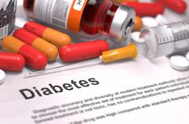

# Diabetes_Analysis
INTRODUCTION:

Diabetes is a chronic condition affecting people of all ages and is prevalent in around 25.8 million people in the U.S. The objective of this research is to predict the probability of a diabetic patient being readmitted. The results from this research will help hospitals design a follow-up protocol to ensure that patients having a higher re-admission probability are doing well to promote a healthy doctor-patient relationship. 

DATA DESCRIPTION:

The data was obtained from the Center for Machine Learning and Intelligent Systems at University of California, Irvine. 
The dataset comprises of data spanning 10 years (1999-2008) of clinical care across 130 US hospitals, encompassing 55 features reflecting patient and hospital outcomes. The data was extracted based on encounters meeting specific criteria: (1) being inpatient admissions, (2) involving diabetic encounters where any form of diabetes was diagnosed, (3) having a length of stay between 1 and 14 days, (4) including laboratory tests during the encounter, and (5) administering medications during the encounter. Attributes within the dataset include patient identifiers, demographic information (race, gender, age), admission details (type, time in hospital), admitting physician's specialty, number of lab tests performed, HbA1c test results, diagnoses, medication details (number and type), as well as the number of outpatient, inpatient, and emergency visits in the year prior to hospitalization, among others.

DATA PREPARATION:

The original dataset had 55 attributes and 101,766 observations. In order to prepare the dataset for
modeling, the data was subjected to intense cleaning procedures which included dealing with missing values,transforming categorical variables to numerics and dealing with imbalanced data. The final dataset created has 98,053 observations and 47 attributes.

EXPLORATORY DATA ANALYSIS:

1. Certain columns in each row are unique identifiers, such as encounter_id and patient_nbr.
2. The columns "Weight," "max_glu_serum," and "A1Cresult" in the dataset contained 97%, 95%, and 83% missing values, respectively. Therefore, these columns were dropped from the dataset.
3. The categorical column "discharge_disposition_id" was mapped to a special category using information obtained from the "IDS_mapping.csv" file.
4. Missing values in the columns 'payer_code' and 'medical_speciality', which account for almost 50% of the data, were replaced using the mode (most frequent value) instead of removing them.
5. The target variable "readmitted" has two classes: '<30' is labeled as '1', indicating readmission within 30 days, while '>30' and 'No' are labeled as '0', indicating no readmission within 30 days.
6. It can be observed the majority of the patients were Caucasian.
7. The age group with the highest diabetic population is 70-80, while the least represented age group is 0-10.

FEATURE ENGINEERING:

1. Categorical variables were converted to numerical variables using Label Encoder.
2. The predictor variables were scaled or normalized to ensure that all feature values were within a similar range. This step is crucial as many machine learning algorithms tend to perform better when features are on a similar scale.

MODEL PERFORMANCE: 

1. The target variable exhibited class imbalance, with 'class 0' comprising 86,986 instances and 'class 1' comprising 11,066 instances.
2. The performance evaluation metrics for the following models—Random Forest Classifier, Logistic Regression, KNeighborsClassifier, DecisionTreeClassifier, and XGBoost Classifier—on the imbalanced data were poor.
3. Oversampling and SMOTE techniques were implemented to handle the imbalanced data, and the models were rebuilt to evaluate the performance metrics for each model.
4. The Random Forest Algorithm built on the oversampled data was identified as the best model, exhibiting the following performance metrics:

        Accuracy: 0.9901553841138759
        Precision: 0.9897795591182365
        Recall: 0.9875531117220695
        F1 Score: 0.9886650819467033
        AUC_ROC: 0.9898549872335838

5. Based on the provided confusion matrix results:

True Negatives (TN): 25,803 instances were correctly predicted as negative.
False Positives (FP): 207 instances were incorrectly predicted as positive when they were actually negative.
False Negatives (FN): 236 instances were incorrectly predicted as negative when they were actually positive.
True Positives (TP): 19,769 instances were correctly predicted as positive.
These values provide insights into the performance of the model in terms of correctly and incorrectly predicted instances for both the positive and negative classes. It's essential to analyze these values to understand the strengths and weaknesses of the model and to determine its overall effectiveness in classification tasks.

CONCLUSION
The hospital data of in-patients having diabetes as an existing condition was analyzed to build a predictive model to identify patients who had a higher likelihood of being
readmitted. Some of the key factors that drove readmission are the number of times a patient was formerly admitted both as an inpatient and outpatient, primary diagnosis, mode of admission, conditions like heart failure or hypertensive chronic kidney disease and so on. Using the model, it can be stated that patients in the top decile have 61.6% higher likelihood of being readmitted.

DISCLAIMER
The authors do not possess any medical expertise. The results are based purely on the data and are not
intended to serve as a medical advice.
